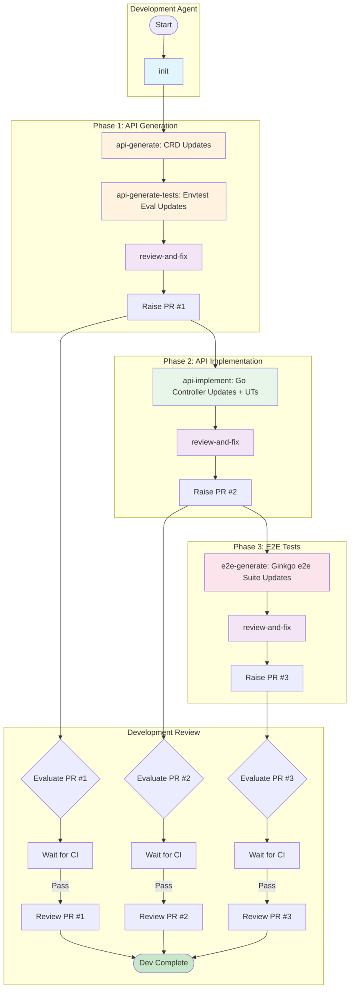

# oape-ai-e2e

Claude-based agentic workflow tool for Kubernetes operator controller development.

## Overview

OAPE (OpenShift App Platform Engineering) provides AI-driven tools for end-to-end feature development in OpenShift operators. Given an Enhancement Proposal (EP) and/or a Jira ticket, it generates:
1. **PR #1** -- API type definitions + integration tests
2. **PR #2** -- Controller/reconciler implementation
3. **PR #3** -- E2E test artifacts

### Input Modes

| Mode | Input | How it works |
|------|-------|-------------|
| **EP-only** | Enhancement Proposal URL | Code generated directly from EP specifications |
| **Jira-only** | Jira ticket key | Analyzes ticket via `/oape:analyze-rfe`, synthesizes a design doc, then generates code |
| **EP + Jira** | Both | EP drives code generation; Jira ticket validates code against acceptance criteria |



## Two Ways to Use OAPE

### 1. Web UI (go-server)

A self-contained Go HTTP server with an embedded web interface. Fill in a form, click "Start Workflow", and watch the 3-PR pipeline run.

```bash
cd go-server
export GH_TOKEN=$(gh auth token)
export CONFIG_DIR=../deploy/config
go run .
# => OAPE server ready at http://localhost:8080
```

The server supports two execution backends:

| Mode | Env var | How it works |
|------|---------|-------------|
| **Local** (default) | `EXECUTION_MODE=local` | Runs the agent as a local subprocess -- no cluster needed |
| **Kubernetes** | `EXECUTION_MODE=k8s` | Creates K8s Jobs on a cluster -- for production deployment |

See [go-server/README.md](go-server/README.md) for full setup, environment variables, and troubleshooting.

### 2. IDE Plugin Commands

Run individual commands directly in Claude Code or Cursor:

```shell
/oape:init https://github.com/openshift/cert-manager-operator main
/oape:api-generate https://github.com/openshift/enhancements/pull/1234
/oape:api-generate-tests api/v1alpha1/
/oape:api-implement https://github.com/openshift/enhancements/pull/1234
/oape:e2e-generate main
```

## Pre-requisites

- **Go 1.23+**: [go.dev/dl](https://go.dev/dl/)
- **Python 3.11**: Required for the agent worker
- **Git**
- **GitHub CLI (`gh`)**: [cli.github.com](https://cli.github.com/), authenticated (`gh auth login`)
- **make**: For `make generate`, `make build`, etc.

### Optional

- **`JIRA_PERSONAL_TOKEN`** -- required for Jira-driven workflows and `/oape:analyze-rfe` (can also be provided per-request via the Web UI)

## Installation (IDE Plugin)

**Claude Code:**
```shell
/plugin marketplace add openshift-eng/oape-ai-e2e
/plugin install oape@oape-ai-e2e
```

**Cursor:**
```bash
mkdir -p ~/.cursor/commands
git clone git@github.com:openshift-eng/oape-ai-e2e.git
ln -s oape-ai-e2e ~/.cursor/commands/oape-ai-e2e
```

## Available Commands

| Command | Description |
|---------|-------------|
| `/oape:init` | Clone an operator repository and checkout the base branch |
| `/oape:api-generate` | Generate Go API types from an Enhancement Proposal |
| `/oape:api-generate-tests` | Generate integration test suites for API types |
| `/oape:api-implement` | Generate controller/reconciler code from an EP |
| `/oape:analyze-rfe` | Analyze a Jira RFE and output EPIC/stories breakdown |
| `/oape:e2e-generate` | Generate e2e test artifacts from git diff |
| `/oape:predict-regressions` | Predict API regressions and breaking changes |
| `/oape:review` | Production-grade code review against Jira requirements |
| `/oape:implement-review-fixes` | Automatically apply fixes from a review report |

See [plugins/oape/README.md](plugins/oape/README.md) for detailed usage of each command.

## Typical Workflow

```shell
# 1. Clone the operator repository
/oape:init https://github.com/openshift/cert-manager-operator main

# 2. Generate API types from an Enhancement Proposal
/oape:api-generate https://github.com/openshift/enhancements/pull/1234

# 3. Generate integration tests
/oape:api-generate-tests api/v1alpha1/

# 4. Predict potential regressions
/oape:predict-regressions main

# 5. Generate controller implementation
/oape:api-implement https://github.com/openshift/enhancements/pull/1234

# 6. Build and verify
make generate && make manifests && make build && make test

# 7. Generate e2e tests
/oape:e2e-generate main
```

## Project Structure

```
oape-ai-e2e/
├── go-server/              # HTTP orchestrator + embedded web UI
│   ├── main.go             # Entry point (dual-mode backend selection)
│   ├── backend.go          # Backend interface
│   ├── process.go          # Local subprocess backend
│   ├── k8s.go              # Kubernetes Job backend
│   ├── handlers.go         # REST API handlers
│   ├── config.go           # Configuration
│   └── static/homepage.html  # Embedded UI
├── agent/                  # Python AI worker
│   ├── main.py             # Worker entrypoint
│   └── agent.py            # Claude Agent SDK workflow logic
├── plugins/oape/           # IDE plugin (commands + skills)
│   ├── commands/           # Slash command definitions
│   └── skills/             # Supporting skill files
├── deploy/                 # Kubernetes deployment manifests
│   ├── config/team-repos.csv  # Allowed repository list
│   ├── deployment.yaml     # K8s Deployment + RBAC + Route
│   └── secret-configs.yaml # Secrets and ConfigMaps
├── images/                 # Dockerfiles
│   ├── go-server.Dockerfile
│   ├── agent-worker.Dockerfile
│   └── gh-token-minter.Dockerfile
└── gh-token-minter/        # GitHub App token sidecar service
```

## Deployment

### Local (no cluster required)

```bash
cd go-server
export GH_TOKEN=$(gh auth token)
export CONFIG_DIR=../deploy/config
go run .
```

### Kubernetes (production)

Build and push the container images:

```shell
podman build -t quay.io/your-username/oape-ai:go-server -f images/go-server.Dockerfile .
podman build -t quay.io/your-username/oape-ai:agent-worker -f images/agent-worker.Dockerfile .
podman build -t quay.io/your-username/oape-ai:gh-token-minter -f images/gh-token-minter.Dockerfile .
```

Deploy to a cluster:

```shell
kubectl apply -k deploy/
```

See `deploy/deployment.yaml` for the full manifest including RBAC, Service, and Route.

## Supported Repositories

The allowed repositories are defined in [`deploy/config/team-repos.csv`](deploy/config/team-repos.csv):

| Product | Role | Repository |
|---------|------|------------|
| cert-manager Operator | upstream operand fork | openshift/jetstack-cert-manager |
| cert-manager Operator | product downstream operator | openshift/cert-manager-operator |
| cert-manager Operator | istio integration | openshift/cert-manager-istio-csr |
| External Secrets Operator | upstream fork | openshift/external-secrets |
| External Secrets Operator | product downstream operator | openshift/external-secrets-operator |
| ZTWIM Operator | product downstream operator | openshift/zero-trust-workload-identity-manager |
| ZTWIM Operator | upstream fork | openshift/spiffe-spire |
| Must Gather Operator | product downstream operator | openshift/must-gather-operator |

## Adding a New Command

1. Add a markdown file under `plugins/oape/commands/`
2. The command becomes available as `/oape:<command-name>`
3. Update `plugins/oape/README.md` with usage docs
